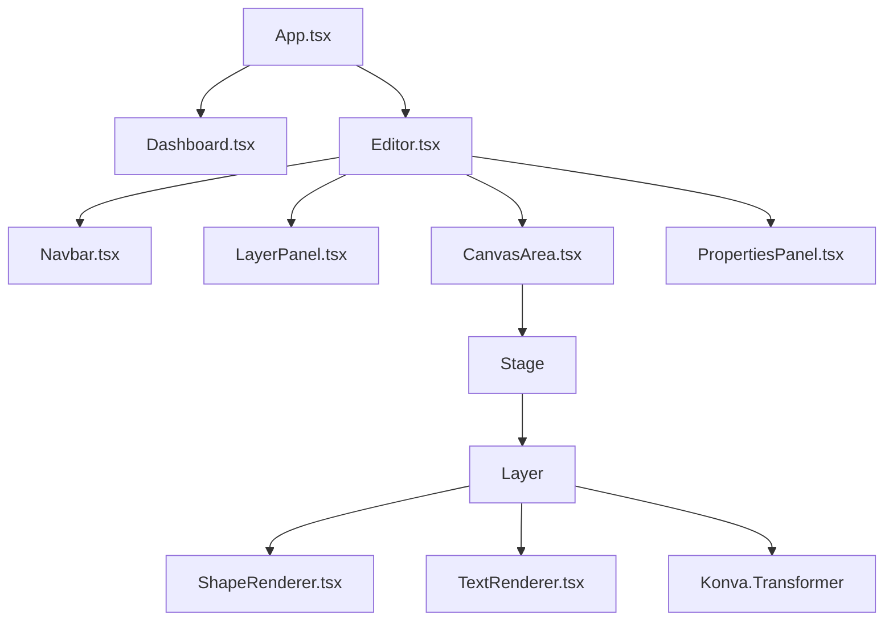

# Architecture Document
## Canvas UI & Color Manager

Dokumen ini menjelaskan arsitektur sistem untuk aplikasi **Canvas UI & Color Manager**, mencakup arsitektur frontend, arsitektur backend, manajemen state, desain API, serta mekanisme ekspor PNG dan Kotlin. Dokumen ini disesuaikan dengan **Shared Color Pack Strategy** di mana data warna dikelola secara terpusat pada entitas Color Pack global.

---

### 1. Frontend Architecture

Frontend dibangun menggunakan **React**, **TypeScript**, dan **Vite** untuk build tool yang cepat. Rendering kanvas interaktif menggunakan library **Konva.js** melalui binding **react-konva**. Styling halaman menggunakan **Vanilla CSS** untuk fleksibilitas maksimal, dengan struktur desain bertema gelap/terang modern (glassmorphism & responsive editor layout).

#### 1.1 Diagram Komponen Frontend


#### 1.2 Penjelasan Komponen Utama
* **Dashboard**: Halaman awal untuk melihat daftar project, membuat project baru, memilih Color Pack, dan menghapus project.
* **Navbar**: Menu atas editor yang berisi informasi project, tombol "Back to Dashboard", toggle Light/Dark Mode, tombol simpan manual, dan drop-down/tombol Export (PNG & Kotlin).
* **Layer Panel (Left Sidebar)**: Panel yang menampilkan urutan komponen di kanvas dari atas ke bawah (berdasarkan z-index). Menyediakan aksi rename layer dan tombol untuk menata urutan layer (*Bring to Front*, *Bring Forward*, *Send Backward*, *Send To Back*).
* **Canvas Area (Center)**: Area visual interaktif tempat `react-konva` merender komponen. Menangani interaksi mouse seperti *click-to-select* dan *drag-and-drop* untuk memindahkan posisi komponen.
* **Properties Panel (Right Sidebar)**: Form dinamis untuk mengedit properti komponen yang sedang dipilih. Menggunakan drop-down berisi token warna dari Color Pack yang aktif terikat (bukan input kode Hex langsung).

---

### 2. Backend Architecture

Backend ditulis dalam bahasa pemrograman **Go** dengan menerapkan **Clean Architecture** (atau Hexagonal Architecture). Hal ini memisahkan logika bisnis (Usecase) dari detail eksternal seperti framework HTTP (Fiber/Gin) dan basis data (PostgreSQL/GORM).

#### 2.1 Layering Architecture
```
┌─────────────────────────────────────────────────────────┐
│                    Delivery / Handler                   │
│         (HTTP REST API, JSON Marshalling, Routing)       │
└────────────────────────────┬────────────────────────────┘
                             │
                             ▼
┌─────────────────────────────────────────────────────────┐
│                    Usecase / Service                    │
│             (Pure Business Logic Validation)            │
└────────────────────────────┬────────────────────────────┘
                             │
                             ▼
┌─────────────────────────────────────────────────────────┐
│                       Repository                        │
│             (GORM SQL Queries, Postgres DB)             │
└─────────────────────────────────────────────────────────┘
```

#### 2.2 Struktur Direktori Backend
```text
.
├── cmd
│   └── api
│       └── main.go              # Entrypoint aplikasi (Setup DI & Router)
├── internal
│   ├── domain                   # Enterprise Business Rules & Models
│   │   ├── project.go
│   │   ├── color_pack.go
│   │   └── canvas_state.go
│   ├── project
│   │   ├── delivery
│   │   │   └── http
│   │   │       └── handler.go   # Router & HTTP Handlers untuk Project
│   │   ├── repository
│   │   │   └── postgres
│   │   │       └── pg_repo.go   # Query Database GORM untuk Project
│   │   └── usecase
│   │       └── usecase.go       # Logika Bisnis Project
│   └── colorpack
│       ├── delivery
│       │   └── http
│       │       └── handler.go   # HTTP Handlers untuk Color Pack
│       ├── repository
│       │   └── postgres
│       │       └── pg_repo.go   # Query Database GORM untuk Color Pack
│       └── usecase
│           └── usecase.go       # Logika Bisnis Color Pack
└── pkg
    └── database                 # Inisialisasi DB (Postgres & GORM)
```

---

### 3. State Management

Aplikasi menggunakan **Zustand** di frontend sebagai single source of truth untuk state editor. Zustand dipilih karena kinerjanya yang sangat efisien dalam meminimalkan re-render pada aplikasi berbasis kanvas/grafis interaktif.

#### 3.1 Desain Model Data TypeScript
Untuk menjamin type safety, berikut adalah spesifikasi model data frontend:

```typescript
export interface BaseComponent {
  id: string;
  name: string;
  type: 'shape' | 'text';
  x: number;
  y: number;
  width: number;
  height: number;
  rotation: number;
  opacity: number;
  zIndex: number;
}

export interface ShapeComponent extends BaseComponent {
  type: 'shape';
  shapeType: 'rectangle' | 'circle';
  fillColorToken: string; // Terikat ke nama token, misal: 'primary'
  borderRadius: {
    topLeft: number;
    topRight: number;
    bottomLeft: number;
    bottomRight: number;
  };
}

export interface TextComponent extends BaseComponent {
  type: 'text';
  textContent: string;
  fontSize: number;
  fontWeight: string;
  fontStyle: 'normal' | 'italic';
  textColorToken: string; // Terikat ke nama token, misal: 'onPrimary'
  letterSpacing: number;
  lineHeight: number;
}

export type CanvasComponent = ShapeComponent | TextComponent;

export interface ColorToken {
  name: string;      // Contoh: 'primary', 'onPrimary', 'background'
  lightHex: string;  // Format: '#FFFFFF'
  darkHex: string;   // Format: '#121212'
}

export interface ColorPack {
  id: string;
  name: string;
  tokens: ColorToken[];
}
```

#### 3.2 Zustand Stores
Zustand dibagi menjadi dua store utama:

1. **`useProjectStore`**:
   - **State**: Daftar project, project aktif, daftar Color Pack, status pemuatan data (*loading*, *error*).
   - **Actions**: `fetchProjects()`, `createProject()`, `deleteProject()`, `selectProject()`.
2. **`useCanvasStore`**:
   - **State**:
     - `components`: Array dari `CanvasComponent`.
     - `selectedId`: String dari ID komponen yang aktif dipilih (null jika tidak ada).
     - `themeMode`: `'light' | 'dark'` (menentukan visualisasi warna aktif).
     - `colorPackId`: String (ID Color Pack yang saat ini terhubung ke project aktif).
     - `isDirty`: Boolean penanda apakah ada perubahan yang belum tersimpan ke backend.
   - **Actions**:
     - `loadCanvasState(components: CanvasComponent[], colorPackId: string)`
     - `setColorPackId(colorPackId: string)`: Mengubah asosiasi Color Pack pada project.
     - `addComponent(component: CanvasComponent)`
     - `updateComponent(id: string, updates: Partial<CanvasComponent>)`
     - `deleteComponent(id: string)`
     - `setThemeMode(mode: 'light' | 'dark')`
     - `reorderComponent(id: string, action: 'front' | 'forward' | 'backward' | 'back')`
     - `saveState()`: Melakukan HTTP PUT untuk menserialisasi data `components` dan `colorPackId` untuk disimpan ke database.

---

### 4. API Architecture

Komunikasi antara frontend dan backend menggunakan REST API dengan format payload JSON.

#### 4.1 Endpoints API

##### 4.1.1 Color Pack Endpoints
* **`GET /api/color-packs`**: Mengambil daftar semua Color Pack yang tersedia.
* **`POST /api/color-packs`**: Membuat Color Pack baru beserta daftar token warnanya.
* **`GET /api/color-packs/:id`**: Mengambil detail satu Color Pack beserta nilai token warnanya.
* **`PUT /api/color-packs/:id`**: Memperbarui nama dan nilai token warna di dalam Color Pack.
* **`DELETE /api/color-packs/:id`**: Menghapus Color Pack (mengembalikan error jika ada project yang masih menggunakannya).

##### 4.1.2 Project Endpoints
* **`GET /api/projects`**: Mengambil daftar project beserta metadata (tanpa payload canvas_state yang besar).
* **`POST /api/projects`**: Membuat project baru.
  - *Request Body*:
    ```json
    {
      "name": "Project Dashboard Baru",
      "color_pack_id": "uuid-color-pack-123"
    }
    ```
* **`GET /api/projects/:id`**: Mengambil detail project lengkap termasuk `canvas_state` (komponen dan tata letak) dan `color_pack_id` yang terikat.
* **`PUT /api/projects/:id`**: Menyimpan/memperbarui state project (termasuk metadata, `color_pack_id` baru, & `canvas_state` penuh).
  - *Request Body*:
    ```json
    {
      "name": "Project Dashboard Baru (Edited)",
      "color_pack_id": "uuid-color-pack-456",
      "canvas_state": [
        {
          "id": "comp-1",
          "name": "Tombol Utama",
          "type": "shape",
          "shapeType": "rectangle",
          "x": 100,
          "y": 150,
          "width": 200,
          "height": 50,
          "rotation": 0,
          "opacity": 1,
          "zIndex": 1,
          "fillColorToken": "primary",
          "borderRadius": { "topLeft": 8, "topRight": 8, "bottomLeft": 8, "bottomRight": 8 }
        }
      ]
    }
    ```
* **`DELETE /api/projects/:id`**: Menghapus project secara permanen.

---

### 5. Export Architecture

#### 5.1 PNG Export
Ekspor PNG dilakukan sepenuhnya di sisi klien (*client-side*) menggunakan fitur bawaan Konva.js untuk mengekstrak data URL dari canvas element.

1. **Seleksi Frame**: Sebelum ekspor, Zustand Store menyembunyikan penanda seleksi (*Transformer frame* / kotak biru di sekeliling komponen aktif) agar tidak ikut terender pada hasil gambar PNG.
2. **Generasi Data URL**: Memanggil method `stage.toDataURL({ pixelRatio: 1 })` untuk mendapatkan string Base64 dari gambar dengan resolusi 1200px x 1200px.
3. **Trigger Download**: Membuat elemen link DOM virtual `<a>` secara dinamis, mengatur `href` ke data URL, memberikan nama file (`[project-name]-[mode].png`), mensimulasikan klik, lalu menghapus kembali elemen link tersebut.
4. **Restore Selection**: Menampilkan kembali Transformer frame ke komponen yang sebelumnya dipilih.

#### 5.2 Kotlin Export (`Color.kt`)
Pembuatan file Kotlin dilakukan di sisi klien dengan membaca data Color Pack yang saat ini terikat pada project aktif.

1. **Pemetaan Warna**: Program melakukan iterasi ke seluruh token warna dalam Color Pack.
2. **Konversi Format Hex**: Mengubah format warna web Hex (`#RRGGBB` atau `#AARRGGBB`) menjadi format Kotlin ARGB Literal (`0xFFRRGGBB`). Jika input tidak memiliki alpha channel, default alpha diatur penuh (`0xFF`).
3. **Template Engine**: Menggunakan string template literal di TypeScript untuk merakit kode Kotlin yang valid.
4. **Unduh File**: Mengonversi teks Kotlin menjadi objek Blob dengan tipe `text/plain` dan mengunduhnya sebagai file bernama `Color.kt`.
