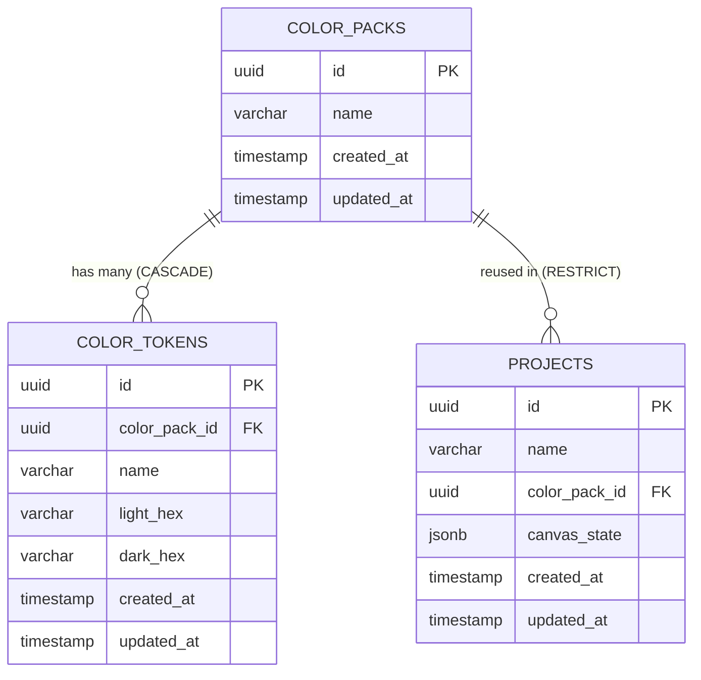

# Database Schema & Design Document
## Canvas UI & Color Manager

Dokumen ini mendefinisikan desain database relasional menggunakan **PostgreSQL** dan **GORM** (Go ORM). Untuk menyimpan layout kanvas yang fleksibel dan dinamis tanpa overhead join tabel yang besar, rancangan ini memanfaatkan tipe data **JSONB** milik PostgreSQL untuk menyimpan array komponen kanvas, sementara manajemen warna diorganisasi secara relasional.

---

### 1. Entity Relationship Diagram (ERD)

Aplikasi memiliki tiga entitas utama: `Project`, `ColorPack`, dan `ColorToken`. 
* Satu `ColorPack` memiliki hubungan One-to-Many (`1:N`) dengan `ColorToken`.
* Satu `ColorPack` dapat digunakan oleh banyak `Project` (`1:N`). Jika `ColorPack` dihapus, database akan menolak penghapusan apabila masih ada `Project` yang menggunakannya (`RESTRICT`).



---

### 2. Table Schemas (DDL SQL)

Berikut adalah perintah SQL DDL untuk inisiasi skema database di PostgreSQL:

```sql
-- Mengaktifkan ekstensi UUID generator
CREATE EXTENSION IF NOT EXISTS "uuid-ossp";

-- 1. Tabel Color Packs
CREATE TABLE color_packs (
    id UUID PRIMARY KEY DEFAULT uuid_generate_v4(),
    name VARCHAR(255) NOT NULL,
    created_at TIMESTAMP WITH TIME ZONE NOT NULL DEFAULT NOW(),
    updated_at TIMESTAMP WITH TIME ZONE NOT NULL DEFAULT NOW()
);

-- 2. Tabel Color Tokens
CREATE TABLE color_tokens (
    id UUID PRIMARY KEY DEFAULT uuid_generate_v4(),
    color_pack_id UUID NOT NULL,
    name VARCHAR(100) NOT NULL,
    light_hex VARCHAR(9) NOT NULL, -- Mendukung #RRGGBB dan #AARRGGBB
    dark_hex VARCHAR(9) NOT NULL,  -- Mendukung #RRGGBB dan #AARRGGBB
    created_at TIMESTAMP WITH TIME ZONE NOT NULL DEFAULT NOW(),
    updated_at TIMESTAMP WITH TIME ZONE NOT NULL DEFAULT NOW(),
    
    -- Constraint Relasi
    CONSTRAINT fk_color_pack 
        FOREIGN KEY(color_pack_id) 
        REFERENCES color_packs(id) 
        ON DELETE CASCADE,
        
    -- Mencegah nama token ganda di dalam satu Color Pack
    CONSTRAINT uq_pack_token_name 
        UNIQUE(color_pack_id, name)
);

-- 3. Tabel Projects
CREATE TABLE projects (
    id UUID PRIMARY KEY DEFAULT uuid_generate_v4(),
    name VARCHAR(255) NOT NULL,
    color_pack_id UUID NOT NULL,
    canvas_state JSONB NOT NULL DEFAULT '[]'::jsonb,
    created_at TIMESTAMP WITH TIME ZONE NOT NULL DEFAULT NOW(),
    updated_at TIMESTAMP WITH TIME ZONE NOT NULL DEFAULT NOW(),
    
    -- Constraint Relasi
    CONSTRAINT fk_project_color_pack 
        FOREIGN KEY(color_pack_id) 
        REFERENCES color_packs(id) 
        ON DELETE RESTRICT
);
```

---

### 3. GORM Models Definition (Golang)

Definisi struct di tingkat aplikasi (Golang) menggunakan GORM untuk auto-migration dan query handling:

```go
package domain

import (
	"time"

	"github.com/google/uuid"
)

// ColorPack merepresentasikan kumpulan token warna Material 3
type ColorPack struct {
	ID        uuid.UUID    `gorm:"type:uuid;primaryKey;default:gen_random_uuid()" json:"id"`
	Name      string       `gorm:"type:varchar(255);not null" json:"name"`
	Tokens    []ColorToken `gorm:"foreignKey:ColorPackID;constraint:OnDelete:CASCADE" json:"tokens,omitempty"`
	CreatedAt time.Time    `gorm:"not null;default:CURRENT_TIMESTAMP" json:"created_at"`
	UpdatedAt time.Time    `gorm:"not null;default:CURRENT_TIMESTAMP" json:"updated_at"`
}

// ColorToken menyimpan pasangan warna Light & Dark mode untuk token M3
type ColorToken struct {
	ID          uuid.UUID `gorm:"type:uuid;primaryKey;default:gen_random_uuid()" json:"id"`
	ColorPackID uuid.UUID `gorm:"type:uuid;not null;uniqueIndex:idx_pack_token" json:"color_pack_id"`
	Name        string    `gorm:"type:varchar(100);not null;uniqueIndex:idx_pack_token" json:"name"`
	LightHex    string    `gorm:"type:varchar(9);not null" json:"light_hex"`
	DarkHex     string    `gorm:"type:varchar(9);not null" json:"dark_hex"`
	CreatedAt   time.Time `gorm:"not null;default:CURRENT_TIMESTAMP" json:"-"`
	UpdatedAt   time.Time `gorm:"not null;default:CURRENT_TIMESTAMP" json:"-"`
}

// Project menyimpan konfigurasi kanvas beserta pemetaan warna
type Project struct {
	ID          uuid.UUID `gorm:"type:uuid;primaryKey;default:gen_random_uuid()" json:"id"`
	Name        string    `gorm:"type:varchar(255);not null" json:"name"`
	ColorPackID uuid.UUID `gorm:"type:uuid;not null" json:"color_pack_id"`
	ColorPack   ColorPack `gorm:"foreignKey:ColorPackID;constraint:OnDelete:RESTRICT" json:"color_pack,omitempty"`
	// CanvasState disimpan sebagai tipe data JSONB di DB, dan string/raw JSON di Golang struct
	CanvasState string    `gorm:"type:jsonb;not null;default:'[]'" json:"canvas_state"`
	CreatedAt   time.Time `gorm:"not null;default:CURRENT_TIMESTAMP" json:"created_at"`
	UpdatedAt   time.Time `gorm:"not null;default:CURRENT_TIMESTAMP" json:"updated_at"`
}
```

---

### 4. Field Definitions

| Tabel | Nama Field | Tipe Data | Deskripsi | Constraints |
| :--- | :--- | :--- | :--- | :--- |
| **`color_packs`** | `id` | UUID | Identifier unik Color Pack | Primary Key, Default UUID v4 |
| | `name` | VARCHAR | Nama Color Pack (misal: "Standard Material 3") | Not Null |
| | `created_at` | TIMESTAMPTZ | Waktu data dibuat | Not Null, Default Now() |
| | `updated_at` | TIMESTAMPTZ | Waktu data diupdate | Not Null, Default Now() |
| **`color_tokens`** | `id` | UUID | Identifier unik Color Token | Primary Key, Default UUID v4 |
| | `color_pack_id` | UUID | Referensi ID Color Pack penampung | FK, Not Null, Cascade Delete |
| | `name` | VARCHAR | Nama token warna M3 (e.g. `primary`) | Not Null, Unique per Pack |
| | `light_hex` | VARCHAR(9) | Kode warna Hex untuk Light Mode | Not Null |
| | `dark_hex` | VARCHAR(9) | Kode warna Hex untuk Dark Mode | Not Null |
| **`projects`** | `id` | UUID | Identifier unik Project | Primary Key, Default UUID v4 |
| | `name` | VARCHAR | Nama Project | Not Null |
| | `color_pack_id` | UUID | Referensi ID Color Pack yang aktif | FK, Not Null, Restrict Delete |
| | `canvas_state` | JSONB | Data serialisasi array komponen kanvas | Not Null, Default '[]' |

---

### 5. Index Recommendations

Indeks sangat penting untuk mempercepat query dan menjaga integritas referensial basis data:

1. **`idx_pack_token` (Unique Index)**:
   - *Kolom*: `(color_pack_id, name)`
   - *Alasan*: Menjamin tidak ada duplikasi token dengan nama yang sama di dalam satu Color Pack, sekaligus mempercepat pencarian warna spesifik saat parsing token komponen.
2. **`idx_projects_color_pack_id` (B-Tree Index)**:
   - *Kolom*: `color_pack_id` di tabel `projects`
   - *Alasan*: PostgreSQL memerlukan indeks pada Foreign Key untuk menghindari scan tabel secara menyeluruh (*table scan*) saat memeriksa relasi `RESTRICT` ketika menghapus/memvalidasi `color_packs`.
3. **`idx_projects_updated_at` (B-Tree Index)**:
   - *Kolom*: `updated_at DESC` di tabel `projects`
   - *Alasan*: Mempercepat pengurutan daftar project di dashboard dari yang paling baru diubah/diakses.
