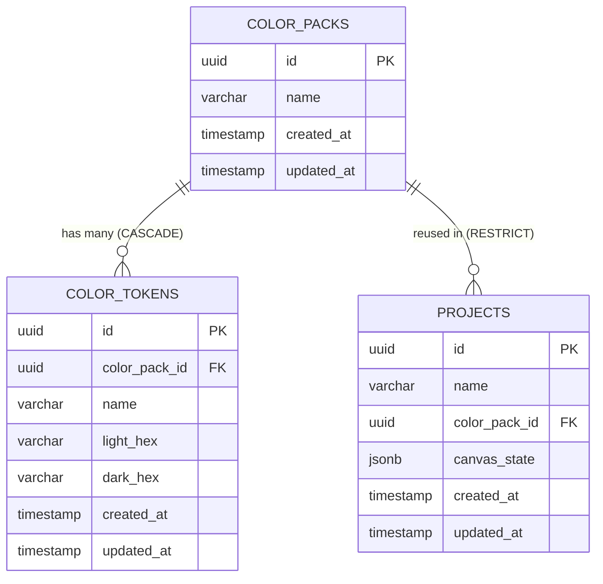

# Database Schema & Design Document
## Canvas UI & Color Manager

Dokumen ini mendefinisikan desain database relasional menggunakan **PostgreSQL** dan **GORM** (Go ORM). Dokumen ini telah disesuaikan dengan **Shared Color Pack Strategy** di mana Color Pack diposisikan sebagai entitas independen global yang digunakan bersama oleh banyak project secara langsung tanpa mekanisme snapshot.

---

### 1. Rationale & Alasan Desain

Untuk memfasilitasi kebutuhan bisnis di mana satu Color Pack digunakan secara langsung oleh banyak project dan perubahan di dalamnya berdampak langsung ke semua project, basis data dirancang dengan pemisahan entitas berikut:

* **Color Pack (Global & Shared)**:
  Direpresentasikan oleh tabel `color_packs` dan `color_tokens`. Entitas ini menyimpan definisi palet warna Material 3 global. Perubahan pada nilai warna token di tabel `color_tokens` akan langsung merefleksikan perubahan warna pada project mana pun yang menggunakannya saat di-render.
* **Project Reference**:
  Tabel `projects` memiliki kolom `color_pack_id` yang terhubung langsung ke `color_packs.id`. Tidak ada penyimpanan data warna lokal di dalam project.
* **Aturan Relasi Terikat (RESTRICT)**:
  Tabel `projects` mengikat `color_pack_id` dengan aturan `ON DELETE RESTRICT`. Hal ini menjamin integritas referensial data di mana user tidak diperbolehkan menghapus suatu Color Pack jika masih dirujuk oleh minimal satu project aktif.

---

### 2. Entity Relationship Diagram (ERD)



---

### 3. Table Schemas (DDL SQL)

Berikut adalah perintah SQL DDL untuk inisiasi skema database di PostgreSQL:

```sql
-- Mengaktifkan ekstensi UUID generator
CREATE EXTENSION IF NOT EXISTS "uuid-ossp";

-- 1. Tabel Color Packs (Global Shared)
CREATE TABLE color_packs (
    id UUID PRIMARY KEY DEFAULT uuid_generate_v4(),
    name VARCHAR(255) NOT NULL,
    created_at TIMESTAMP WITH TIME ZONE NOT NULL DEFAULT NOW(),
    updated_at TIMESTAMP WITH TIME ZONE NOT NULL DEFAULT NOW()
);

-- 2. Tabel Color Tokens (Shared M3 Tokens)
CREATE TABLE color_tokens (
    id UUID PRIMARY KEY DEFAULT uuid_generate_v4(),
    color_pack_id UUID NOT NULL,
    name VARCHAR(100) NOT NULL,
    light_hex VARCHAR(9) NOT NULL, -- Mendukung #RRGGBB dan #AARRGGBB
    dark_hex VARCHAR(9) NOT NULL,  -- Mendukung #RRGGBB dan #AARRGGBB
    created_at TIMESTAMP WITH TIME ZONE NOT NULL DEFAULT NOW(),
    updated_at TIMESTAMP WITH TIME ZONE NOT NULL DEFAULT NOW(),
    
    -- Constraint Relasi
    CONSTRAINT fk_color_pack 
        FOREIGN KEY(color_pack_id) 
        REFERENCES color_packs(id) 
        ON DELETE CASCADE,
        
    -- Mencegah nama token ganda di dalam satu Color Pack
    CONSTRAINT uq_pack_token_name 
        UNIQUE(color_pack_id, name)
);

-- 3. Tabel Projects
CREATE TABLE projects (
    id UUID PRIMARY KEY DEFAULT uuid_generate_v4(),
    name VARCHAR(255) NOT NULL,
    color_pack_id UUID NOT NULL,
    canvas_state JSONB NOT NULL DEFAULT '[]'::jsonb, -- Menyimpan array komponen kanvas
    created_at TIMESTAMP WITH TIME ZONE NOT NULL DEFAULT NOW(),
    updated_at TIMESTAMP WITH TIME ZONE NOT NULL DEFAULT NOW(),
    
    -- Constraint Relasi (Mencegah penghapusan Color Pack jika masih digunakan oleh project)
    CONSTRAINT fk_project_color_pack 
        FOREIGN KEY(color_pack_id) 
        REFERENCES color_packs(id) 
        ON DELETE RESTRICT
);
```

---

### 4. GORM Models Definition (Golang Structs)

Definisi struct di tingkat aplikasi (Golang) menggunakan GORM untuk auto-migration dan query handling:

```go
package domain

import (
	"time"

	"github.com/google/uuid"
)

// ColorPack merepresentasikan kumpulan token warna Material 3 global
type ColorPack struct {
	ID        uuid.UUID    `gorm:"type:uuid;primaryKey;default:gen_random_uuid()" json:"id"`
	Name      string       `gorm:"type:varchar(255);not null" json:"name"`
	Tokens    []ColorToken `gorm:"foreignKey:ColorPackID;constraint:OnDelete:CASCADE" json:"tokens,omitempty"`
	CreatedAt time.Time    `gorm:"not null;default:CURRENT_TIMESTAMP" json:"created_at"`
	UpdatedAt time.Time    `gorm:"not null;default:CURRENT_TIMESTAMP" json:"updated_at"`
}

// ColorToken menyimpan pasangan warna Light & Dark mode untuk token M3 global
type ColorToken struct {
	ID          uuid.UUID `gorm:"type:uuid;primaryKey;default:gen_random_uuid()" json:"id"`
	ColorPackID uuid.UUID `gorm:"type:uuid;not null;uniqueIndex:idx_pack_token" json:"color_pack_id"`
	Name        string    `gorm:"type:varchar(100);not null;uniqueIndex:idx_pack_token" json:"name"`
	LightHex    string    `gorm:"type:varchar(9);not null" json:"light_hex"`
	DarkHex     string    `gorm:"type:varchar(9);not null" json:"dark_hex"`
	CreatedAt   time.Time `gorm:"not null;default:CURRENT_TIMESTAMP" json:"-"`
	UpdatedAt   time.Time `gorm:"not null;default:CURRENT_TIMESTAMP" json:"-"`
}

// Project menyimpan konfigurasi kanvas beserta referensi Color Pack global
type Project struct {
	ID          uuid.UUID `gorm:"type:uuid;primaryKey;default:gen_random_uuid()" json:"id"`
	Name        string    `gorm:"type:varchar(255);not null" json:"name"`
	ColorPackID uuid.UUID `gorm:"type:uuid;not null" json:"color_pack_id"`
	ColorPack   ColorPack `gorm:"foreignKey:ColorPackID;constraint:OnDelete:RESTRICT" json:"color_pack,omitempty"`
	CanvasState string    `gorm:"type:jsonb;not null;default:'[]'" json:"canvas_state"`
	CreatedAt   time.Time `gorm:"not null;default:CURRENT_TIMESTAMP" json:"created_at"`
	UpdatedAt   time.Time `gorm:"not null;default:CURRENT_TIMESTAMP" json:"updated_at"`
}
```

---

### 5. Field Definitions

| Tabel | Nama Field | Tipe Data | Deskripsi | Constraints |
| :--- | :--- | :--- | :--- | :--- |
| **`color_packs`** | `id` | UUID | Identifier unik Color Pack | Primary Key, Default UUID v4 |
| | `name` | VARCHAR | Nama Color Pack | Not Null |
| | `created_at` | TIMESTAMPTZ | Waktu data dibuat | Not Null, Default Now() |
| | `updated_at` | TIMESTAMPTZ | Waktu data diupdate | Not Null, Default Now() |
| **`color_tokens`** | `id` | UUID | Identifier unik token | Primary Key, Default UUID v4 |
| | `color_pack_id` | UUID | Referensi ID Color Pack penampung | FK, Not Null, Cascade Delete |
| | `name` | VARCHAR | Nama token warna M3 (e.g. `primary`) | Not Null, Unique per Pack |
| | `light_hex` | VARCHAR(9) | Kode warna Hex Light Mode | Not Null |
| | `dark_hex` | VARCHAR(9) | Kode warna Hex Dark Mode | Not Null |
| **`projects`** | `id` | UUID | Identifier unik Project | Primary Key, Default UUID v4 |
| | `name` | VARCHAR | Nama Project | Not Null |
| | `color_pack_id` | UUID | Referensi ke Color Pack yang aktif | FK, Not Null, On Delete Restrict |
| | `canvas_state` | JSONB | Data koordinat & properti layer kanvas | Not Null, Default '[]' |

---

### 6. Index Recommendations

Penyusunan indeks untuk performa query aplikasi kanvas:

1. **`idx_pack_token` (Unique Index)**:
   - *Kolom*: `(color_pack_id, name)`
   - *Alasan*: Menjamin keunikan nama token per Color Pack serta mempercepat lookup pencarian warna saat rendering kanvas.
2. **`idx_projects_color_pack_id` (B-Tree Index)**:
   - *Kolom*: `color_pack_id`
   - *Alasan*: Mengurangi overhead pemeriksaan foreign key `RESTRICT` saat melakukan penghapusan Color Pack.
3. **`idx_projects_updated_at` (B-Tree Index)**:
   - *Kolom*: `updated_at DESC`
   - *Alasan*: Mempercepat sorting project terbaru di Dashboard.
