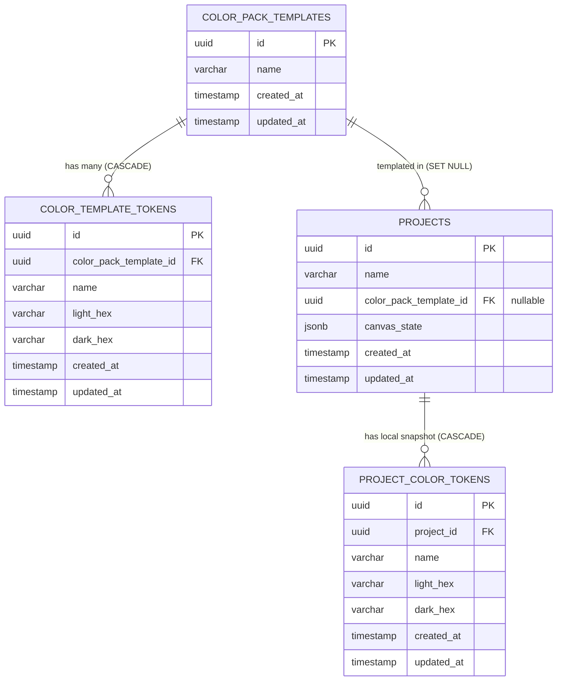

# Database Schema & Design Document
## Canvas UI & Color Manager

Dokumen ini mendefinisikan desain database relasional menggunakan **PostgreSQL** dan **GORM** (Go ORM). Dokumen ini telah diperbarui untuk menerapkan **Snapshot Color Pack Strategy** guna mendukung independensi skema warna pada setiap project.

---

### 1. Rationale & Alasan Desain

Untuk memfasilitasi kebutuhan bisnis di mana setiap project harus memiliki kontrol warna secara mandiri tanpa memengaruhi project lain atau template global, basis data dirancang dengan pemisahan entitas berikut:

* **Color Pack Template**:
  Direpresentasikan oleh tabel `color_pack_templates` dan `color_template_tokens`. Entitas ini berfungsi sebagai pustaka palet warna global/standar yang dapat dipilih oleh pengguna saat membuat project baru.
* **Project Theme Snapshot**:
  Direpresentasikan oleh tabel `project_color_tokens`. Ketika sebuah project dibuat, sistem menduplikasi seluruh data warna dari template terpilih ke tabel ini. Hubungan warna visual pada komponen kanvas diikat langsung ke tabel snapshot lokal ini.
* **Isolasi Relasi**:
  Relasi foreign key dari tabel `projects` ke `color_pack_templates` diatur menggunakan `ON DELETE SET NULL` dan bersifat opsional (nullable). Dengan demikian, jika sebuah template dihapus dari sistem, project yang sudah ada tetap aman dan tidak kehilangan datanya karena ia memegang salinan warna sendiri secara lokal.

---

### 2. Entity Relationship Diagram (ERD)



---

### 3. Table Schemas (DDL SQL)

Berikut adalah perintah SQL DDL untuk inisiasi skema database di PostgreSQL:

```sql
-- Mengaktifkan ekstensi UUID generator
CREATE EXTENSION IF NOT EXISTS "uuid-ossp";

-- 1. Tabel Color Pack Templates (Global Blueprint)
CREATE TABLE color_pack_templates (
    id UUID PRIMARY KEY DEFAULT uuid_generate_v4(),
    name VARCHAR(255) NOT NULL,
    created_at TIMESTAMP WITH TIME ZONE NOT NULL DEFAULT NOW(),
    updated_at TIMESTAMP WITH TIME ZONE NOT NULL DEFAULT NOW()
);

-- 2. Tabel Color Template Tokens (Global Blueprint Tokens)
CREATE TABLE color_template_tokens (
    id UUID PRIMARY KEY DEFAULT uuid_generate_v4(),
    color_pack_template_id UUID NOT NULL,
    name VARCHAR(100) NOT NULL,
    light_hex VARCHAR(9) NOT NULL, -- Mendukung #RRGGBB dan #AARRGGBB
    dark_hex VARCHAR(9) NOT NULL,  -- Mendukung #RRGGBB dan #AARRGGBB
    created_at TIMESTAMP WITH TIME ZONE NOT NULL DEFAULT NOW(),
    updated_at TIMESTAMP WITH TIME ZONE NOT NULL DEFAULT NOW(),
    
    -- Constraint Relasi
    CONSTRAINT fk_template 
        FOREIGN KEY(color_pack_template_id) 
        REFERENCES color_pack_templates(id) 
        ON DELETE CASCADE,
        
    -- Mencegah nama token ganda di dalam satu template
    CONSTRAINT uq_template_token 
        UNIQUE(color_pack_template_id, name)
);

-- 3. Tabel Projects
CREATE TABLE projects (
    id UUID PRIMARY KEY DEFAULT uuid_generate_v4(),
    name VARCHAR(255) NOT NULL,
    color_pack_template_id UUID, -- Nullable (Audit reference ke template global asal)
    canvas_state JSONB NOT NULL DEFAULT '[]'::jsonb, -- Menyimpan array komponen kanvas
    created_at TIMESTAMP WITH TIME ZONE NOT NULL DEFAULT NOW(),
    updated_at TIMESTAMP WITH TIME ZONE NOT NULL DEFAULT NOW(),
    
    -- Constraint Relasi (Set NULL jika template aslinya dihapus)
    CONSTRAINT fk_project_template 
        FOREIGN KEY(color_pack_template_id) 
        REFERENCES color_pack_templates(id) 
        ON DELETE SET NULL
);

-- 4. Tabel Project Color Tokens (Project Theme Snapshot Lokal)
CREATE TABLE project_color_tokens (
    id UUID PRIMARY KEY DEFAULT uuid_generate_v4(),
    project_id UUID NOT NULL,
    name VARCHAR(100) NOT NULL,
    light_hex VARCHAR(9) NOT NULL,
    dark_hex VARCHAR(9) NOT NULL,
    created_at TIMESTAMP WITH TIME ZONE NOT NULL DEFAULT NOW(),
    updated_at TIMESTAMP WITH TIME ZONE NOT NULL DEFAULT NOW(),
    
    -- Constraint Relasi (Hapus otomatis jika project dihapus)
    CONSTRAINT fk_project_tokens 
        FOREIGN KEY(project_id) 
        REFERENCES projects(id) 
        ON DELETE CASCADE,
        
    -- Mencegah nama token ganda dalam satu project
    CONSTRAINT uq_project_token 
        UNIQUE(project_id, name)
);
```

---

### 4. GORM Models Definition (Golang Structs)

Definisi struct di tingkat aplikasi (Golang) menggunakan GORM untuk auto-migration dan query handling:

```go
package domain

import (
	"time"

	"github.com/google/uuid"
)

// ColorPackTemplate merepresentasikan blueprint/template palet warna global
type ColorPackTemplate struct {
	ID        uuid.UUID            `gorm:"type:uuid;primaryKey;default:gen_random_uuid()" json:"id"`
	Name      string               `gorm:"type:varchar(255);not null" json:"name"`
	Tokens    []ColorTemplateToken `gorm:"foreignKey:ColorPackTemplateID;constraint:OnDelete:CASCADE" json:"tokens,omitempty"`
	CreatedAt time.Time            `gorm:"not null;default:CURRENT_TIMESTAMP" json:"created_at"`
	UpdatedAt time.Time            `gorm:"not null;default:CURRENT_TIMESTAMP" json:"updated_at"`
}

// ColorTemplateToken menyimpan token warna global untuk template
type ColorTemplateToken struct {
	ID                  uuid.UUID `gorm:"type:uuid;primaryKey;default:gen_random_uuid()" json:"id"`
	ColorPackTemplateID uuid.UUID `gorm:"type:uuid;not null;uniqueIndex:idx_template_token" json:"color_pack_template_id"`
	Name                string    `gorm:"type:varchar(100);not null;uniqueIndex:idx_template_token" json:"name"`
	LightHex            string    `gorm:"type:varchar(9);not null" json:"light_hex"`
	DarkHex             string    `gorm:"type:varchar(9);not null" json:"dark_hex"`
	CreatedAt           time.Time `gorm:"not null;default:CURRENT_TIMESTAMP" json:"-"`
	UpdatedAt           time.Time `gorm:"not null;default:CURRENT_TIMESTAMP" json:"-"`
}

// Project menyimpan konfigurasi kanvas dan memegang snapshot warna lokal
type Project struct {
	ID                  uuid.UUID           `gorm:"type:uuid;primaryKey;default:gen_random_uuid()" json:"id"`
	Name                string              `gorm:"type:varchar(255);not null" json:"name"`
	ColorPackTemplateID *uuid.UUID          `gorm:"type:uuid" json:"color_pack_template_id"` // Nullable
	CanvasState         string              `gorm:"type:jsonb;not null;default:'[]'" json:"canvas_state"`
	ColorTokens         []ProjectColorToken `gorm:"foreignKey:ProjectID;constraint:OnDelete:CASCADE" json:"color_tokens,omitempty"`
	CreatedAt           time.Time           `gorm:"not null;default:CURRENT_TIMESTAMP" json:"created_at"`
	UpdatedAt           time.Time           `gorm:"not null;default:CURRENT_TIMESTAMP" json:"updated_at"`
}

// ProjectColorToken menyimpan token warna lokal milik Project tertentu (Snapshot)
type ProjectColorToken struct {
	ID        uuid.UUID `gorm:"type:uuid;primaryKey;default:gen_random_uuid()" json:"id"`
	ProjectID uuid.UUID `gorm:"type:uuid;not null;uniqueIndex:idx_project_token" json:"project_id"`
	Name      string    `gorm:"type:varchar(100);not null;uniqueIndex:idx_project_token" json:"name"`
	LightHex  string    `gorm:"type:varchar(9);not null" json:"light_hex"`
	DarkHex   string    `gorm:"type:varchar(9);not null" json:"dark_hex"`
	CreatedAt time.Time `gorm:"not null;default:CURRENT_TIMESTAMP" json:"-"`
	UpdatedAt time.Time `gorm:"not null;default:CURRENT_TIMESTAMP" json:"-"`
}
```

---

### 5. Field Definitions

| Tabel | Nama Field | Tipe Data | Deskripsi | Constraints |
| :--- | :--- | :--- | :--- | :--- |
| **`color_pack_templates`** | `id` | UUID | Identifier unik template global | Primary Key, Default UUID v4 |
| | `name` | VARCHAR | Nama template warna global | Not Null |
| | `created_at` | TIMESTAMPTZ | Waktu data dibuat | Not Null, Default Now() |
| | `updated_at` | TIMESTAMPTZ | Waktu data diupdate | Not Null, Default Now() |
| **`color_template_tokens`** | `id` | UUID | Identifier unik token template | Primary Key, Default UUID v4 |
| | `color_pack_template_id` | UUID | Referensi ID template global | FK, Not Null, Cascade Delete |
| | `name` | VARCHAR | Nama token warna M3 (e.g. `primary`) | Not Null, Unique per Template |
| | `light_hex` | VARCHAR(9) | Kode warna Hex Light Mode | Not Null |
| | `dark_hex` | VARCHAR(9) | Kode warna Hex Dark Mode | Not Null |
| **`projects`** | `id` | UUID | Identifier unik Project | Primary Key, Default UUID v4 |
| | `name` | VARCHAR | Nama Project | Not Null |
| | `color_pack_template_id` | UUID | Referensi ke template asal | FK, Nullable, On Delete Set Null |
| | `canvas_state` | JSONB | Data koordinat & properti layer kanvas | Not Null, Default '[]' |
| **`project_color_tokens`** | `id` | UUID | Identifier unik token snapshot project | Primary Key, Default UUID v4 |
| | `project_id` | UUID | Referensi ID Project pemilik snapshot | FK, Not Null, Cascade Delete |
| | `name` | VARCHAR | Nama token warna M3 | Not Null, Unique per Project |
| | `light_hex` | VARCHAR(9) | Kode warna Hex Light Mode lokal | Not Null |
| | `dark_hex` | VARCHAR(9) | Kode warna Hex Dark Mode lokal | Not Null |

---

### 6. Index Recommendations

Penyusunan indeks untuk performa baca/tulis aplikasi kanvas:

1. **`idx_template_token` (Unique Index)**:
   - *Kolom*: `(color_pack_template_id, name)`
   - *Alasan*: Menjamin keunikan nama token per template global serta mempercepat lookup saat penyalinan token.
2. **`idx_project_token` (Unique Index)**:
   - *Kolom*: `(project_id, name)`
   - *Alasan*: Menjamin keunikan nama token per project agar rendering warna kanvas melalui join cepat dan tidak terjadi tumpang tindih data.
3. **`idx_projects_template_id` (B-Tree Index)**:
   - *Kolom*: `color_pack_template_id`
   - *Alasan*: Mengurangi overhead pemeriksaan foreign key `SET NULL` saat melakukan penghapusan template global.
4. **`idx_projects_updated_at` (B-Tree Index)**:
   - *Kolom*: `updated_at DESC`
   - *Alasan*: Mempercepat sorting project terbaru di Dashboard.
